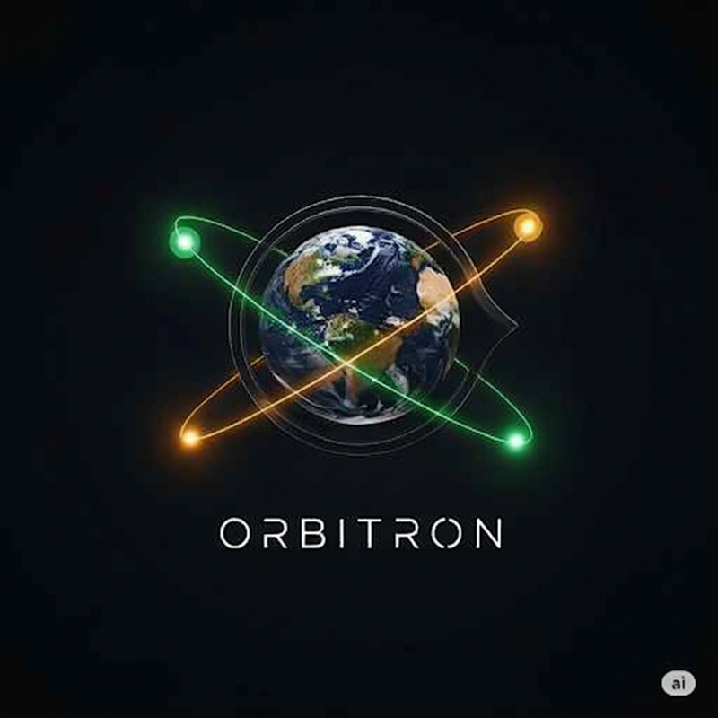

<div align="center">
  
  <h1>🚀 Orbitron-AI</h1>
  <h3>Intelligent Crypto Market Analysis Platform</h3>
  
  [](https://python.org)
  [](LICENSE)
  []()
  [](https://ollama.ai)
  
  **Следете "умните пари" с AI-базиран пазарен анализ**
</div>

## 📊 Live Demo & Screenshots

<div align="center">
  
  <p><i>Orbitron-AI Dashboard - Real-time market intelligence</i></p>
</div>

> **💡 Pro Tip**: Планирате live demo? Добавете GIF или видео показващо dashboard-а в action!

---

## 🎯 Какво е Orbitron-AI?

Orbitron-AI е автоматизирана платформа за анализ на криптовалутните пазари, която се фокусира върху проследяването на **"Smart Money"** - институционални инвеститори и големи пазарни участници, чиито действия често предшестват значими ценови движения.

### Защо е различен?
- 🧠 **AI-базиран анализ** чрез Ollama за разбиране на пазарните настроения
- 📊 **Четиримерен подход**: Фундаментален + Технически + On-Chain + Sentiment анализ
- 🔄 **Реално време**: Автоматично събиране и обработка на данни
- 📈 **Интерактивен дашборд** за лесна визуализация на резултатите

---

## 🏗️ Архитектура

```
🌐 Data Sources → 🗄️ SQLite DB → 🤖 AI Analysis → 📊 Streamlit Dashboard
    ↓                ↓              ↓               ↓
NewsAPI, RSS    DatabaseManager   Ollama         Interactive UI
CoinGecko       Centralized       Local AI       Real-time Charts
KuCoin API      Storage          Analysis        Alert System
DefiLlama       SQLite           Sentiment       Export Tools
```

### Файлова структура:
```
Orbitron-Refactored/
├── 🔐 .env                    # API ключове (НЕ в Git)
├── ⚙️ config.py               # Конфигурация
├── 📦 requirements.txt        # Dependencies
├── 📁 src/
│   ├── 📊 analysis/           # AI & анализ модули
│   ├── 🖥️ dashboard/          # Streamlit UI
│   ├── 📥 data_ingestion/     # Data collectors
│   ├── 🗄️ database/           # DB management
│   └── 🛠️ utils/              # Helper functions
├── 📜 scripts/                # Execution scripts
├── 📁 data/                   # Local database
└── 🧪 tests/                  # Test suite
```

---

## ⚡ Бърз старт

### 1. Подготовка
```bash
# Клониране на проекта
git clone [your-repo-url]
cd Orbitron-Refactored

# Създаване на виртуална среда
python3 -m venv venv
source venv/bin/activate  # Linux/Mac
# venv\Scripts\activate   # Windows

# Инсталиране на dependencies
pip install -r requirements.txt
```

### 2. Конфигурация
Създайте `.env` файл в root директорията:
```env
# API Keys
NEWS_API_KEY=your_newsapi_key_here
KUCOIN_API_KEY=your_kucoin_key_here
KUCOIN_API_SECRET=your_kucoin_secret_here
KUCOIN_API_PASSPHRASE=your_kucoin_passphrase_here

# Ollama Configuration
OLLAMA_HOST=localhost:11434
OLLAMA_MODEL=llama3.2
```

### 3. Инициализация
```bash
# Създаване на базата данни
python scripts/init_db.py

# Стартиране на data pipeline
python scripts/run_pipeline.py

# Стартиране на dashboard
streamlit run src/dashboard/app.py
```

🎉 **Готово!** Отворете браузъра на `http://localhost:8501`

---

## 🔧 Основни Компоненти

### 📊 AI Analyzer
- **Модел**: Ollama (локално deployment)
- **Функции**: Sentiment analysis, pattern recognition, trend prediction
- **Input**: Новини, социални медии, пазарни данни
- **Output**: Структуриран анализ с confidence scores

### 📈 Data Sources
| Източник | Тип данни | Честота |
|----------|-----------|---------|
| NewsAPI | Новини, анализи | Реално време |
| CoinGecko | Ценови данни, метрики | 5 мин |
| KuCoin | Trading данни, order book | 1 мин |
| DefiLlama | On-chain метрики | 1 час |
| RSS Feeds | Специализирани новини | 15 мин |

### 🖥️ Dashboard Features
- **Real-time charts** за цени и обеми
- **AI insights** с confidence индикатори  
- **Alert system** за важни събития
- **Historical analysis** за past performance
- **Export functionality** за reports

---

## 🗺️ Roadmap

### ✅ Фаза 1: Foundation (Завършена)
- [x] Модулна архитектура
- [x] Базов data pipeline  
- [x] AI интеграция (Ollama)
- [x] SQLite database
- [x] Streamlit dashboard

### 🎯 Фаза 2: Enhanced Analytics (Текуща)
- [ ] KuCoin API интеграция
- [ ] DefiLlama on-chain данни
- [ ] Технически индикатори (RSI, MACD, SMA)
- [ ] Подобрено логване

### 🧠 Фаза 3: Predictive Intelligence
- [ ] Anomaly detection
- [ ] Historical event archive
- [ ] Pattern matching система
- [ ] Probabilistic forecasting

### 🚀 Фаза 4: Production Ready
- [ ] Advanced dashboard с custom charts
- [ ] Multi-timeframe analysis
- [ ] Portfolio tracking & risk management
- [ ] REST API за external integrations
- [ ] Docker containerization
- [ ] Cloud deployment готовност

### 🌟 Фаза 5: Enterprise & Innovation
- [ ] **Machine Learning Pipeline**: Custom ML модели за price prediction
- [ ] **Multi-Asset Support**: Stocks, Forex, Commodities expansion  
- [ ] **Social Trading**: Copy-trading и signal sharing
- [ ] **Mobile App**: iOS/Android companion app
- [ ] **Institutional Features**: White-label solutions
- [ ] **DeFi Integration**: Yield farming & liquidity analysis
- [ ] **Research Platform**: Automated research reports

---

## 🛠️ Развитие

### Изисквания
- Python 3.8+
- Ollama (за AI анализ)
- SQLite3
- 4GB+ RAM препоръчителни

### Testing
```bash
# Пускане на тестовете
pytest tests/

# Coverage report
pytest --cov=src tests/
```

### Contributing
1. Fork проекта
2. Създайте feature branch (`git checkout -b feature/AmazingFeature`)
3. Commit промените (`git commit -m 'Add AmazingFeature'`)
4. Push към branch (`git push origin feature/AmazingFeature`)
5. Отворете Pull Request

---

## ⚠️ Важни бележки

### Ollama Management
Автоматичните актуализации са **деактивирани** за стабилност. За ръчно управление:
```bash
# Проверка на версията
ollama --version

# Ръчна актуализация (внимателно!)
ollama pull [model-name]
```

### Security
- ❌ Никога не commit-вайте `.env` файла
- 🔐 Използвайте strong API keys
- 🛡️ Редовно ротирайте ключовете
- 📝 Review logs за suspicious activity

---

## 📜 Лиценз

Този проект е лицензиран под MIT License - вижте [LICENSE](LICENSE) файла за подробности.

---

## 🤝 Community & Support

<div align="center">

### 📞 Свържете се с нас
📧 **Email**: [aleksandardimitrov981@gmail.com]  
💬 **Issues**: [GitHub Issues](https://github.com/your-username/orbitron-ai/issues)  
📖 **Wiki**: [Detailed Documentation](https://github.com/your-username/orbitron-ai/wiki)  
💼 **LinkedIn**: [Your LinkedIn Profile]  

### 🌟 Show Your Support
⭐ **Star the repo** ако Orbitron-AI ви помага!  
🔄 **Share** с crypto community  
🐛 **Report bugs** за по-добра платформа  
💡 **Suggest features** за бъдещи версии  

### 🏆 Contributors
Благодарим на всички, които допринасят за развитието на Orbitron-AI!

<!-- Contributors list will be auto-generated -->


</div>

---

<div align="center">

**⭐ Ако Orbitron-AI ви помага в трейдинга, оставете звездичка! ⭐**

Made with 💎 for the crypto community

</div>
